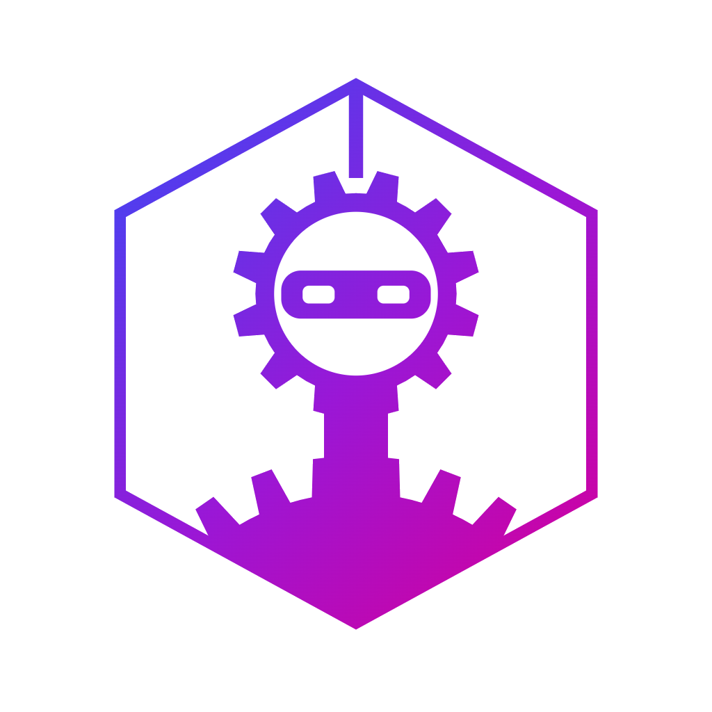

# Whiphand (`whiphand`)



`whiphand` runs **workflows** against a working folder: an ordered set of steps — an LLM CLI runner
(`claude`, `copilot`, `opencode`) with its own model and tool policy, a shell command, or a stop to
ask a human — which can be wrapped in a **cycle** that repeats until a check passes. The
canonical workflow plans a feature interactively with one model, then implements, tests and
reviews it in a loop until the review comes back clean.

## Install

Requires Node ≥ 24 (runs TypeScript natively — no build step) and at least one of
`claude` / `copilot` / `opencode` on PATH.

```bash
npm install
node packages/cli/src/main.ts --help    # or: npm link --workspace packages/cli && whiphand --help
```

## Quickstart

```bash
whiphand doctor                                                              # check the tools whiphand needs are installed
whiphand init                                                                # scaffold .whiphand/ (config + starter workflows) here
whiphand new-workflow review-pr                                              # scaffold .whiphand/workflows/review-pr.yaml
whiphand run examples/cycle.yaml --dry-run --input feature=demo              # print every argv, spend nothing
whiphand run examples/feature.yaml --input feature="oauth support"           # the real thing
whiphand run examples/cycle.yaml --input feature=x --max-iterations 5 --yes  # override the loop budget; don't ask
whiphand run --resume 20260907-141233-a3f1 --extra-iterations 2              # continue a stopped run; grant 2 more iterations to any exhausted loop
whiphand run feature --input feature="oauth support" --name "OAuth support"  # label the run
whiphand run feature --input feature="fix login" --attach ./bug.png --attach ./server.log  # hand files to the plan step
whiphand rename-run 20260907-141233-a3f1 "Something better"                  # relabel it later ('' clears)
```

Workflows live in `.whiphand/workflows/<name>.yaml` (so `whiphand run feature` works) or anywhere as a
path. Artifacts land in `.whiphand/runs/<run-id>/` as plain markdown. Workspace defaults live in
`.whiphand/config.yaml`.

`whiphand init` ships three starter workflows, and every one of them ends the same way: a human
sign-off that can send the work back with comments for another cycle, not just ship it or kill
it. `feature` plans once, interactively, then implements and reviews in a cycle until the sign-off
approves it — pick it when the shape of the change is already clear. `spec-driven` adds a second
planning phase and grills you on both, then stops at an approval gate before any code is written,
before its own implement/review/sign-off cycle. `feature-development` does the same as `feature`
but on its own branch — it syncs your trunk, cuts `feature/<run slug>`, and commits the signed-off
work with a message it writes from the diff.

A run can carry a **name** (`--name`, the desktop's New run dialog, or later with
`whiphand rename-run`, where `''` clears it), shown in place of its id in the UI and
notifications. See `docs/design.md` for how a step sees its run's name and how auto-naming
works.

## Checking your setup (`whiphand doctor`)

`whiphand doctor` reports what this machine has, in two groups — the same data the desktop's
Doctor page renders, so the two can never disagree:

```
AI harnesses
✔ claude 2.1.263
✔ copilot 1.0.83
  · copilot will not signal when it needs you; set "beep": true in ~/.copilot/settings.json
✔ opencode 1.17.13
○ codex not installed [detect only]

Support tools
✔ git 2.53.0
✔ node 24.16.0
○ fd not installed
```

`✔` installed · `✘` missing and required · `○` missing but optional. `[detect only]`
marks a harness whiphand can see but has no adapter for — it will not be offered as a
workflow's `runner:`.

### Adding your own tools

Doctor's built-in table lives in `packages/core/src/tools.ts`. To extend it on your own
machine, hand-write `doctor.yaml` beside your global `config.yaml`:

| Platform | Path |
|---|---|
| Linux | `~/.config/whiphand/doctor.yaml` |
| macOS | `~/Library/Application Support/whiphand/doctor.yaml` |
| Windows | `%APPDATA%\whiphand\doctor.yaml` |

(`WHIPHAND_CONFIG_HOME` overrides the directory.)

```yaml
tools:
  - id: bun                # a new id is appended to its group
    label: Bun
    group: support         # 'harness' or 'support'
    argv: [bun, --version]
    url: https://bun.sh

  - id: rtk                # an existing id REPLACES that built-in, in place
    label: rtk
    group: support
    argv: [rtk, --version]
    version_pattern: 'v?(\d+\.\d+\.\d+)'   # capture group 1 is the version
    optional: false        # missing is then an error, not a shrug
    aliases: [rtk-bin]     # other binary names to try, in order

hide: [cursor-agent, jq]   # drop built-ins you do not care about
```

Every key is validated and unknown ones are rejected, so a typo tells you rather than
silently doing nothing. Overriding a built-in changes its label, group, url and
`optional`, but detection for `claude`, `copilot` and `opencode` always goes through their
adapters — that is where their setup advice (copilot's `beep` note, opencode's PATH note)
comes from.

It is a **separate file from `config.yaml` on purpose**: `config.yaml` is rewritten
wholesale whenever settings are saved, so anything unrecognized in it would be lost.
Nothing writes `doctor.yaml`.

## Workflow format

See `docs/design.md` for the full reference. The short version:

```yaml
name: cycle
inputs:
  feature: { required: true }
  test_command: { required: false, default: npm test }
steps:
  - id: plan          # live terminal chat; artifact harvested from the session afterwards
    runner: claude
    model: opus
    mode: interactive
    writes: false
    output: plan.md
    prompt: |
      We are planning: {{ inputs.feature }}. Work with me on a plan. Do not modify files.

  - id: human-review  # repeats fix-cycle until `sign-off` approves
    kind: loop
    until: sign-off
    max_iterations: 5
    steps:
      - id: fix-cycle   # repeat the body until `review` returns VERDICT: PASS
        kind: loop
        until: review
        max_iterations: 3
        steps:
          - id: test-fix    # repeats until the tests pass, before `review` ever runs
            kind: loop
            until: tests
            max_iterations: 3
            steps:
              - id: execute   # headless; may write
                runner: copilot
                model: gpt-5.5
                mode: headless
                writes: true
                # `tests`, `review` and `sign-off` are forward references: the
                # previous iteration's/round's log, findings and feedback,
                # each dropped when its own loop has none yet to read.
                inputs: [plan, tests, review, sign-off]
                output: execute-report.md
                prompt: |
                  Implement the attached plan. If a tests log marked VERDICT: FAIL
                  is attached, fix every failure it shows first.

              - id: tests     # a shell command: no runner, no tokens
                kind: command
                run: "{{ inputs.test_command }}"
                verdict: true            # non-zero exit sends test-fix round again
                output: tests.log

          - id: review    # headless, read-only, must emit VERDICT: PASS|FAIL
            runner: claude
            model: haiku
            mode: headless
            writes: false
            verdict: true
            inputs: [plan, execute, tests, sign-off]
            output: findings.md
            prompt: |
              Review the diff against the plan. If sign-off feedback is
              attached, FAIL unless every requested change is addressed.

      - id: sign-off      # stops and asks you, showing the diff
        kind: approval
        verdict: true             # required: this is what the outer loop's `until` reads
        title: Ship it?
        instructions: Approve, or request changes with comments on the whole change or on individual files.
        show_diff: true
        capture: review           # per-file comments; required to answer "request changes"
        inputs: [review]
        output: feedback.md
```

`execute` reads `tests`, `review` and `sign-off` as forward references, each resolving to its
own loop's previous pass and dropped when that loop has none yet — so a round that requests
changes, or a run that just failed its tests, sends fresh feedback back into the next attempt.
That's the shape every starter workflow ships with — see `docs/design.md`'s "Sending work
back" section for the nested-loop details.

**Step kinds.** `agent` (the default), `command`, `manual`, `approval`, and `loop` — a cycle
over its own `steps` that repeats until its `until` step passes, bounded by
`max_iterations`. `verdict: true` makes any step report pass/fail (an agent's `VERDICT:`
line, a command's exit code, a human's answer) instead of failing the run outright — that is
what a loop's `until` watches, and what `on_findings` (below) reacts to outside a loop.

**Human steps.** `manual` and `approval` stop the run and ask — on a terminal `whiphand`
prompts you; without one it fails naming the step, unless `--yes` takes the step's default.
The desktop app gives the decision the whole page: `show_diff: true` shows the working tree
side by side, and `capture: review` turns the screen into a place to leave per-file feedback
that feeds back into the next loop iteration on `retry`.

**Stages.** `kind: stages` runs its own `steps` once per file in a directory instead of once
over one input — build stage 1, get it reviewed and accepted, commit it, then move to stage
2 — so a large feature never needs one sign-off over the whole diff at the end. `items` is a
templated glob (`{{ inputs.plan_dir }}/*.md`, re-globbed before every stage, so an added file
is picked up and a deleted pending one is skipped); a stage's id is its file's basename
without extension, and renaming or renumbering an already-completed stage file makes it run
again under its new id. `{{ stage.index }}`, `{{ stage.total }}`, `{{ stage.id }}`,
`{{ stage.title }}` (and `$WHIPHAND_STAGE_ID`/`_TITLE`/`_INDEX`/`_TOTAL`/`_PATH` for a
`command` step) read the stage currently running, and `inputs: [stage]` attaches its file —
all four only exist inside a `stages` body. Every `verdict: true` step in a stage's body
(a loop's `until` included) must be followed by a gate placed directly in the body, not
inside a loop. A loop that runs out inside a stage ends there and hands over to that gate.
Rejecting at the gate re-runs the whole stage, with the rejection handed to the last
`writes: true` step before the gate, up to `max_retries` (default 2) before it hands the
stage to you in a live session. `allow_paths` on a `writes: true` step fails it, naming the
file, if it touched anything outside the given globs. See the shipped
`staged-feature-development` workflow and `docs/design.md`'s "Stages" section for the rest.
That workflow's commit steps are POSIX shell lines, so on Windows they do not run under the
default `cmd.exe`.

**Attachments.** `--attach <path>` (repeatable — or the desktop's New Run dialog: pick,
drop, or paste an image) copies a file into the run before step one; a step reads them by
naming the reserved ref `attachments` in its `inputs:`.

See `docs/design.md` for the full reference: cycles and resuming an exhausted loop, stages,
disabling a step, `on_findings` (what happens when a review outside a loop finds problems),
and every rule above in detail.

## Desktop app

`apps/desktop` is a Tauri + Fluent UI shell over the same `@whiphand/core` engine the CLI
uses — workflows, runs, and cancellation behave identically in both; the desktop app
just adds a GUI (workflow picker, live run view, xterm-backed interactive handoff, and a
Files tab: a tree of the opened workspace with rendered-markdown preview and in-place
editing).

The sidebar is grouped by scope: a workspace switcher on top, then the pages that act
on the open workspace (Runs, Workflows, Files, Settings), then the ones that don't
(Activity, Doctor, Preferences). Activity lists runs across every recent workspace;
workspaces can be pinned, and Ctrl/Cmd+K switches between them.

Above Activity, an "Ongoing runs" section lists live jobs — running, or blocked on
you — as clickable rows with a status pill, so switching to the one that needs
attention doesn't require a detour through the Activity grid; waiting jobs sort to the
top. It's capped at 5 rows, with a "+N more" row into Activity, and can be turned off
from Preferences.

The Files tab reaches the filesystem through Tauri's fs plugin, whose scope
starts empty and is extended at runtime to directories you explicitly open, pick in a
folder dialog, or drop on the window; the agent's RPC surface has no file methods.

Prerequisites: Node ≥ 24, a Rust toolchain (`cargo`), and on Linux the webkit2gtk
dev packages (`libwebkit2gtk-4.1-dev libgtk-3-dev libayatana-appindicator3-dev
librsvg2-dev`).

```bash
npm run tauri dev -w desktop   # launch the desktop app in dev mode
npm run verify                 # local CI-equivalent gate — see below
```

`npm run verify` runs the same checks as CI in one fail-fast chain: root
typecheck/tests, the CLI/desktop parity suite (`npm run test:parity` — verifies the
desktop app's surface and behavior match the CLI, see `parity/`), the desktop app's
own tests and build, and finally `cargo check` against `apps/desktop/src-tauri`. If
`cargo` isn't installed, that last step is skipped with a warning instead of failing.

**Wayland troubleshooting**: if the desktop window opens with a blank webview under
Wayland/webkitgtk, set `WEBKIT_DISABLE_COMPOSITING_MODE=1` and
`WEBKIT_DISABLE_DMABUF_RENDERER=1` in the environment before launching.

### Remote access (browser, LAN only)

The desktop app can serve the same UI to a browser on another computer on your
network, so you can watch a run, read its logs and diff, answer an approval, or
start and cancel work from a laptop in another room. Turn it on in
**Preferences → Remote access**, then open the URL it shows (or scan the QR code).

> **Read this before turning it on.**
>
> - **Anyone with the link can run commands on the host machine.** That is what
>   Whiphand does: `startRun` executes a workflow, `ptyInput` types into a live
>   session, and the browser can edit workflow YAML — which *is* the list of commands
>   to run. Treat the link exactly as you would an open terminal on that machine.
> - **The connection is plain HTTP, with no TLS.** The token and everything the run
>   prints cross the network in the clear. Anyone who can capture your network traffic
>   — shared Wi-Fi without client isolation, a compromised device on the LAN — gets the
>   token, and with it the machine.
>
> Use it on a network you control. It is off by default and stays off until you
> explicitly enable it.

How it works: the agent sidecar the desktop app already runs also listens on a TCP
port (61338 by default), serving the browser bundle over HTTP and the same NDJSON
JSON-RPC protocol over a WebSocket. Access is gated on a 256-bit token carried in the
URL fragment — never sent to the server, so it stays out of access logs — and stored
per-origin in the browser. Because a WebSocket upgrade is not subject to CORS, the
agent additionally validates the `Host` and `Origin` headers on every request, which
is what stops a DNS-rebinding attack from a page you visit elsewhere. Rotating the
token disconnects every device using the old link.

Two differences from the desktop app:

- **No Files tab.** Browsing the workspace reads the local disk directly, which a
  browser on another machine cannot do. Run artifacts and diffs still work, because
  those go through the agent's RPC rather than the filesystem.
- **No folder picker.** Recent workspaces are one click away; anything else is opened
  by typing its path.

Runs already in progress replay in full when a browser attaches — the agent keeps a
per-job transcript of terminal and log output, so checking in halfway through a run
shows what already happened rather than an empty pane.

## Standalone binaries

Both artifacts can be built as self-contained executables that need no repo, no
`npm install`, and no Node on the target machine.

```bash
npm run package:cli       # dist/whiphand (dist/whiphand.exe on Windows) — the CLI as one file
npm run package:desktop   # dist/*.deb + dist/*.AppImage on Linux, an NSIS installer on Windows
npm run package           # both
npm run reinstall         # Ubuntu: build the .deb, then apt-remove and reinstall it
```

`dist/whiphand` is an esbuild bundle injected into a copy of this machine's Node binary
(a [single executable application](https://nodejs.org/api/single-executable-applications.html)),
so it is ~120 MB — that is the Node runtime, not the app. Copy it anywhere on PATH and
run `whiphand` as usual. `claude` / `copilot` / `opencode` are still runtime prerequisites;
`whiphand doctor` reports them, along with everything else this machine needs.

`npm run package:desktop` builds the `@whiphand/agent` sidecar the same way, hands it to
Tauri's bundler as an `externalBin`, and produces a `.deb` to install and an
`.AppImage` to run from anywhere. Each packaging script finishes by smoke-testing what
it built (`scripts/package/smoke.mjs`), so a broken binary is not produced silently.

`npm run reinstall` is the Ubuntu edit/install/verify loop in one command: it builds the
`.deb`, removes the installed package, then installs what it just built (`sudo` is used
for the two apt steps, so expect a password prompt). The removal is not just tidiness —
the version is pinned across builds, so `apt-get install` over an already-installed
`0.1.0` is a no-op and the new bundle would silently not land.

**These are built natively and link this machine's glibc**, so they run on the Ubuntu
release that built them, not on older ones. Building for wider reach means building in
an older-glibc container.

**Releases are started by hand from GitHub Actions**: bump the version
(`npm run bump -- 0.1.4`) in a PR and merge it, then on GitHub go to
**Actions → Release → Run workflow** on `main` and enter `0.1.4`. Releases are immutable, so
a version can only be released once. See `docs/design.md` for the full release,
auto-update, and updater-signing-key process, and for how to roll back a bad release.

**Windows downloads are unsigned.** There is no code-signing certificate yet — the seam for
one exists (`WHIPHAND_SIGN_COMMAND` for `whiphand.exe`, Tauri's `bundle.windows.signCommand`
for the installer) but is unset. `WHIPHAND_SIGN_COMMAND` must name a single executable, not
a full command line with its own arguments — it is resolved and spawned directly, never
through a shell. Expect Windows SmartScreen's "Windows protected your PC" prompt on first
run, and don't be surprised if antivirus software flags either binary: a ~110 MB
`postject`-modified `node.exe` and an installer with no publisher signature are both shapes
heuristic scanners dislike. Neither is a defect in the build; both go away once a real
certificate is in place.

## Docs

- `docs/design.md` — why this exists, the architecture, and every workflow-format detail
  this README only summarizes.
- `docs/superpowers/specs/2026-09-08-staged-plans-design.md` — design for the not-yet-built
  staged/multi-commit plan feature.
- `docs/review-backlog.md` — known issues and larger refactors, not yet scheduled.
